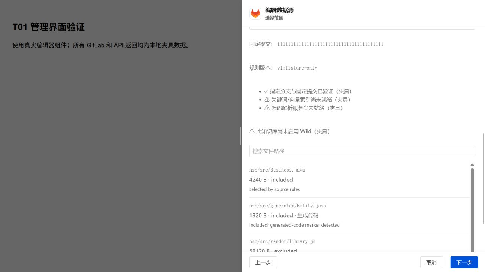

# GitLab 源码配置与固定提交预览（T01）

管理员可在知识库数据源编辑器中选择 GitLab 的“源码”模式，绑定一个项目和指定分支，填写纳入目录、排除路径并预览固定提交的文件清单。未指定 `settings.content_mode` 的旧配置继续使用文档模式。此切片对应 [Issue #9](https://github.com/rudyvv/myWeknora/issues/9)；源码解析、双索引发布和代码阅读将在 T02 接入，此时源码同步明确返回“source ingestion pipeline is not available”。

## 配置

模式保存在既有加密数据源配置的 `settings` 中，凭据继续通过现有 credentials 子资源管理，不进入预览请求或响应。源码模式要求一个 `projects` 项目及非空 `ref` 分支。

```json
{
  "content_mode": "source",
  "projects": [{"project_id": "123", "ref": "main", "paths": ["nsb/src", "evip-dashboard/src"]}],
  "exclude_paths": ["nsb/src/main/webapp/vendor"],
  "max_file_bytes": 2097152
}
```

`paths` 为空表示整个仓库。规则是仓库内相对文件或目录路径，目录包含其后代；不是 glob 表达式。`max_file_bytes` 默认为 2 MiB，可配置 1 字节至 16 MiB。服务端保存 `rules_version`，有效规则或项目/分支变化时版本改变；凭据变化不改变规则版本。

源码凭据要求可验证的只读 GitLab token：`read_api`、`read_repository`，可附加 `read_user`。服务端通过 `GET /personal_access_tokens/self` 校验范围；该端点不可用时明确报错，不推断 token 是只读的。旧文档模式沿用原有凭据要求。GitLab 的权限范围定义见 [官方文档](https://docs.gitlab.com/security/tokens/access_token_scopes/)，token self 接口见 [官方 API](https://docs.gitlab.com/api/personal_access_tokens/)。

凭据轮换验证身份和只读范围，分支可用性由预览单独检查；已选分支被删除时仍可换入有效的新 token。

## 预览 API

`POST /api/v1/datasource/:id/source-preview`，请求 `{"settings": {...}}`。`settings` 可省略以使用已保存的规则；请求不能替换凭据。接口采用现有 Admin、租户、知识库和 API-key 范围检查，返回项目、分支、固定 SHA、规则版本、完整文件列表和能力检查结果。

预览先用 REST 校验已授权项目及真实分支，再获取该 SHA 的 Git 对象。只允许使用配置中 GitLab 实例同一 origin 的 HTTP clone URL。Git 的 HTTP 请求经本地随机路径桥接到现有 SSRF 安全客户端，继承拨号时校验，禁止重定向；token 不进入命令参数、环境、Git 配置或子进程日志。使用临时 bare 对象库、空模板和禁用的 hooks，不 checkout，不运行仓库脚本、过滤器或子模块。

逐项展示纳入/排除原因、原始 blob SHA、大小、生成代码标记及编码。`dist`、`plugins` 名称不会自动排除其全部内容；生成代码保留并标记。压缩 `.min.js`/`.min.css` 资源有明确排除原因。LFS 仅获取指针，子模块及符号链接不展开；超限、未知编码、UTF-16 暂未解析等状态可见，不以空文件冒充源码。整体获取或对象读取失败会让预览失败，不返回不完整的成功清单。

清单最多 100,000 项、Git 清单输出最多 32 MiB、单次 Git HTTP 响应最多 512 MiB；整个预览期限为两分钟。原始文件只读于受控 Git 对象库，按批读取；临时目录请求结束后清理。T02 将建立持久源码快照缓存和独立证据存储。

## 能力检查与当前阶段

双索引检查使用知识库实际绑定的、经过租户所有权验证的 PostgreSQL 引擎，并检查其 `vector` 和 `pg_search` 扩展；知识库须启用关键词、向量索引。Embedding 模型必须存在、属于该租户或为内置模型、类型正确、处于 active 且维度有效，不能仅凭模型 ID 宣告就绪。Wiki 未启用时显示提示，不修改知识库开关或 Agent AllowedTools。

`SOURCE_PARSER_URL` 是部署端配置的解析服务地址，健康检查为 `GET /health`，响应要求 `{"ready":true,"parser_version":"<locked version>","languages":["java"]}`。缺失、不可达、无版本或不支持 Java 时报告未就绪。T01 尚未安装解析服务或开启源码同步，`can_sync` 保持 false；管理员可保存配置和规则，不能误入文档解析/Wiki 后处理链路。预览本身不创建 Knowledge、检索索引、WikiPage 或摘要。

## 验证

测试入口为数据源公开服务/HTTP API 和管理界面的用户操作。受控 GitLab REST/Smart HTTP 服务配合真实 Git 仓库验证固定提交、中文路径、CRLF、规则、生成代码、LFS、子模块、超大文件、编码及只读 token；数据库边界夹具验证扩展、模型缺失及跨租户模型不会误报就绪，也验证能力全部就绪的情况。HTTP API 验证租户和 API-key 知识库范围在访问仓库前生效。真实编辑器的本地夹具截图见下图；不是实际内网仓库的验收结果。



前端类型检查及编辑器 10 项测试通过；源码服务/HTTP 权限、文档入库及普通 Wiki 后处理与修订的针对性回归通过。最终全量前端测试 586/587 通过，CLI POSIX-shell 测试因 Windows 缺少 `/bin/sh` 失败。独立规范与 Spec 双轴复审均无剩余问题。全量 Go 测试已执行但未全通过，完整分类见 [T01 验证记录](plans/gitlab-code-wiki-rag-t01-validation.md)。源码解析及真实双索引发布属于 T02，此处数据库替身仅验证预检行为。

## 可选 Push Hook（T20）

源码模式的数据源卡片提供 Push Hook 配置和测试。管理员在界面输入共享 Secret 并启用回调后，仍需**手动**进入已绑定 GitLab 项目的 Settings → Webhooks：粘贴界面生成的完整回调 URL，仅勾选 Push events，并填写相同的 Secret。WeKnora 不调用 GitLab Admin API，不会创建或管理项目 Hook；MR、Issue、Pipeline 事件不在范围内。

后端权威回调路径为 `/api/v1/gitlab/webhooks/push`。API 返回相对路径，界面用当前站点 origin 和已有 API/base-path 配置组成绝对 URL。例如部署在 `https://example.test/weknora/` 时，复制的地址为 `https://example.test/weknora/api/v1/gitlab/webhooks/push`。该地址不会从任意 Host 或 X-Forwarded 请求头写入配置。

GitLab Push Hook 由 `X-Gitlab-Event: Push Hook` 和 `X-Gitlab-Token` 认证。接收端只用 payload 的 project ID 与 `refs/heads/<branch>` 精确匹配当前活动、未暂停的 GitLab 源码数据源；payload 不能选择 workspace、数据源或知识库，也不能指定同步 SHA。Webhook ID、幂等键或事件 UUID用于投递去重；回调先将收据和既有源码同步协调器中的触发器原子持久化，再快速返回。Worker 随后读取当前已注册分支 HEAD。无有效入站收据时，界面保持“未验证”。

定时对账仍保留：源码模式空 `sync_schedule` 默认每小时运行，也可用数据源同步频率配置调整。它处理 GitLab 批量推送或丢失 Hook 等未通知变化，不依赖事件 payload 的提交范围。连接测试分别显示已注册项目/分支的只读读取结果和入站收据状态；出站读取成功不会被当作入站可达性证明。实际 GitLab 主机到部署回调的公网/内网可达性、Hook 交付和版本兼容仍须在部署环境中核验。
