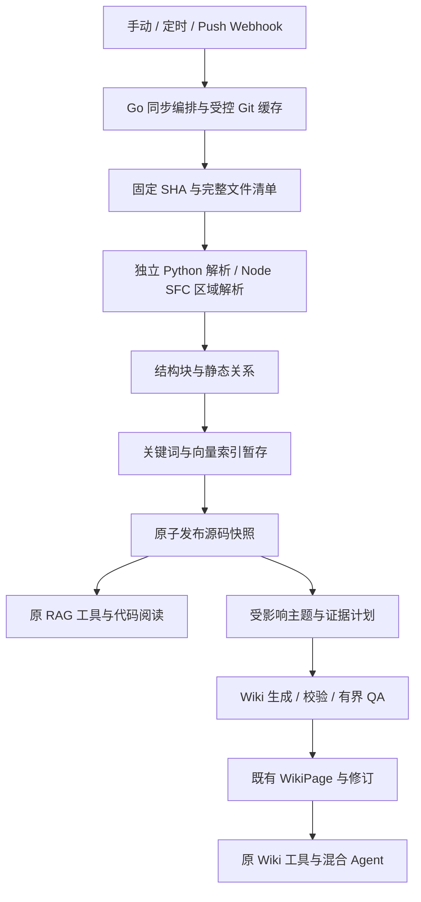

# GitLab 源码、技术 WikiPage 与 RAG 整体改造方案

日期：2026-09-28。工作分支：`codex/gitlab-code-wiki-rag`。

状态：Q1–Q38 均已确认，整体方案已达到共同理解，作为后续 Spec 与 tickets 的产品实施基线。具体数据结构、处理接口和初始调参属于已审阅的实施建议，依赖和性能仍需实施验收。当前仅修改文档，未实现功能、安装依赖或执行基准。决策依据见 [访谈记录](gitlab-code-wiki-rag-design.md)、[解析库调研](source-parser-library-research.md)、根目录 CONTEXT.md 及 ADR-0003–0009。

## 1. 交付范围

保留现有文档接入与加工，新增 GitLab 源码增量同步、可追溯技术 WikiPage 和源码关键词/向量检索。一个代码同步源绑定一个项目、指定分支、目标知识库；知识库允许混合多个仓库与文档。首期只检索各源当前已发布快照，证据固定到 SHA；历史源码仅用于保留中的引用阅读。

首批结构解析语言为 Java、JavaScript、TypeScript、Python，Java 8 是代表仓库的重点。Vue SFC 作为复合文件解析，保留原 `.vue` 坐标；MyBatis XML/SQL 为重要辅助结构。HTML、JSP、FreeMarker、样式、YAML、Dockerfile 等保留文本/结构切块和位置检索，不承诺全部嵌入语言语义。

使用内网自建 GitLab 的只读身份。源码及历史证据按 WeKnora 知识库、文件/tag 范围授权；不对每次阅读做 GitLab 用户权限映射。允许服务端缓存仓库，并将源码发送给已配置的生成和 Embedding 模型。

接入、凭据和清除由管理员在既定知识库管理权限内控制。卡片保留仓库命名空间，主题身份使用代码同步源与模块/主题键，不能仅凭同名 Service 或类自动把两个仓库合并成一个事实；多来源聚合保留各自证据与授权范围。

沿用可选择的 RAG、Wiki、Wiki+RAG Agent 预设及实际 AllowedTools，不强制每个问题调用两路工具。源码双索引发布要求所选知识库具备关键词与向量能力，卡片生成使用 Wiki 能力；配置预检明确提示缺少的能力，不自动改变现有知识库或 Agent 权限。仅使用 Wiki Agent 不等于必须关闭底层源码双索引。

## 2. 架构与职责

| 单元 | 负责 | 接入既有能力的方式 |
| --- | --- | --- |
| Go 源码同步编排 | 配置、凭据、触发、租约、Git、清单、快照状态与发布 | 扩展 DataSource 配置/调度/运行日志，普通文档走原路由 |
| 独立代码解析服务 | 成品结构解析/分块、混合语言映射、质量和原始位置 | 专用结构接口，不复用 Markdown 输出后再通用分块 |
| 源码索引适配 | 关键词、Embedding、索引批写、版本范围、标识符匹配 | PostgreSQL/ParadeDB 首期验收，复用索引引擎接口及检索融合 |
| 技术 Wiki 编排 | 主题骨架、依赖、证据、受影响卡片、预算与 QA | 复用页面合并、目录、编辑、修订、来源清理与 Wiki 工具 |
| 代码证据管理 | 不可变原文、SHA/路径/区间、保留关系、授权阅读 | 复用文件服务/资源管理原则，新增源码及页面修订的引用关系 |

源码必须有显式处理路由：既有 `processChunks` 会清旧数据、立即启用新块并触发普通后处理，后处理会每文件生成摘要/Wiki。源码只复用可分离的批索引、Embedding、存储与权限能力，不直接照常运行整个文档管线。源码文件成为稳定 Knowledge 身份，但不因此为每个文件自动生成摘要卡片。依据：`knowledge_process.go:331/471/706`、`knowledge_post_process.go:208/211`。

## 3. 建议的数据模型

下列是逻辑结构与约束，表名在迁移实现时固定。核心数据有类型化字段与索引，不只放进自由 JSON。

| 结构 | 主要字段与约束 |
| --- | --- |
| 代码同步源状态 | tenant/KB/source ID、GitLab 项目/分支、生命周期、配置代数、published snapshot ID、待追赶标记、租约 owner/expiry/fencing token；沿用每数据源加密凭据 |
| 同步运行 | 固定目标 SHA、配置/加工版本、各阶段状态与计数、错误/重试、已消费预算；同 source+SHA+有效加工配置可幂等恢复 |
| 源码快照 | source ID、commit SHA、完整 manifest 摘要、加工/过滤版本、关键词/向量准备状态、发布序号/时间；发布快照不可原地改写 |
| 快照文件成员 | snapshot+规范化仓库路径、blob/content hash、文件版本 ID、纳入/排除分类及原因；完整清单具有终结与校验标记 |
| 逻辑源文件 | source ID、稳定 file/Knowledge ID、当前路径与授权/tag 身份；不能每次更新删旧再建 ID |
| 文件版本/解析产物 | 原文资源、编码/hash、逻辑文件身份、解析器/grammar/规则/切块版本、质量、块和符号；相同产物可被多个快照引用 |
| 源码块 | 原文区间、语言/区域、符号/父结构、质量、内容与结构化索引字段；可沿用 Text 类型并增加类型化 code metadata，所有入口识别该来源 |
| 静态关系 | 起点/终点文件版本与符号、关系种类、证据/置信状态、提取规则版本；与所属文件产物一起版本化 |
| Wiki 代码贡献/证据 | page+source+文件身份、正文段落/章节、证据 ID、原始 SHA/path/span、依赖清单、validated snapshot；页面可有多来源贡献 |
| 修订证据与资源引用 | revision ID、该正文对应的来源/证据清单、原文资源 owner；修订裁剪或页面删除释放引用 |

稳定 Knowledge 身份用于复用文件选择、标签和授权；物理文件版本与检索块另建模。文件删除只从当前快照成员移除，保留中的历史证据仍需要有可授权的历史来源身份，不能因为普通列表不再展示该文件就暴露匿名对象。重命名可确定时延续逻辑身份，路径及归属变化仍重新评估权限、主题与索引文本；无法确定则按删除+新增处理，不伪造重命名关系。

Q36 已确认：Git 管理的源文件在所有服务端写入口识别来源，禁止普通文档接口编辑/回滚块正文、直接开关块、普通重解析及跨库 move/clone；UI 同时说明由仓库同步管理。现有 Text 编辑及普通 reparse 分别可能改原文、先清资源再排文档任务（`internal/application/service/chunk.go:405`、`internal/application/service/knowledge_process.go:2542`），不能仅保护同步 worker。标签和描述继续按既有权限管理；重新加工走新的源码运行与快照发布。移除单文件通过数据源排除规则、预览与新快照生效，不直接删除 Knowledge 或仍被历史证据引用的原文；跨库接入在目标库建立独立代码同步源。显式清除仓库知识仍走第 9 节流程。技术 Wiki 正文仍保留既有编辑和修订能力。

切块产物复用键至少包含源文件内容、语言/区域配置、解析/切块规则及上下文策略。向量复用还包含模型身份、维度及实际 embedding 文本；若模型版本不能可靠识别，使用本地受控版本号，修改配置后失效。路径或签名变化导致 embedding 文本变化时不能仅凭 blob hash 复用向量。

同一块可在后续快照复用；当前检索返回的 SHA 来自该次请求的快照成员，不能把首次建块的提交当成当前提交。Wiki 已生成的证据则保持其原始 SHA，另记录它在哪份新快照上验证适用。

## 4. 获取、过滤与增量

1. 首次接入执行项目/分支和知识库能力预检，扫描固定 SHA 的文件清单，展示纳入、排除、生成、超大与异常文件预览。
2. 使用受控服务端 Git 缓存获取指定分支；REST 用于项目发现、元数据与权限验证。优先 bare/object 读取，按固定 SHA 列树和取 blob，无需 checkout 或运行目标构建、过滤器、脚本、插件。
3. 明确第三方、压缩资产、二进制和确认的构建副本默认排除；包含/排除规则按路径可调并版本化。不能单凭 `dist` 或 `plugins` 名字全部排除，代表仓库的 `webapp/dist` 含业务内容。
4. 自动生成代码用标记与内容特征分类，仍纳入搜索，减少主动 Wiki 主题；Mapper SQL、接口、字段可进入业务证据。未知分类可预览调整，不把整个 DAO/WebService 目录一律当成生成代码。
5. 对连续完整清单计算新增、变更、删除；Git rename 信息和 hash 辅助重命名识别。未变文件可复用产物，但本次 manifest 和过滤范围仍完整校验。
6. force-push、旧提交缺失或差异不可用时，对两个固定内容状态做完整清单对账，不依赖祖先关系或 Webhook 提供完整 diff；旧 manifest 是可靠对账依据。
7. 分支消失、鉴权失效、解析/索引失败保留上一已发布快照，显示故障与最后成功时间；不自动切到默认分支、不将访问错误推断为仓库删除。

子模块、LFS 指针或不支持的编码/文件类型若被发现，应在预览中明确说明真实内容是否可获取；不能把指针文本、未拉取子仓库或不可读文件算作已解析源码。本期不自动扩大到新的仓库授权范围。用户明确排除的内容记录排除原因，其余应处理内容不可读取时快照不能宣称完整成功。

更新过滤、解析规则或模型配置即使 HEAD 未变，也可能需要新加工产物；幂等判断不能只比较 SHA。

## 5. 结构接口、切块与位置

独立 Python 服务优先验收 Tree-sitter language-pack 成品 chunker，Node 组件只做官方 SFC 区域解析。构建时预装锁定 grammar 与版本，运行时不联网下载解析器。成品不符合区间、覆盖或超大结构要求时，补足薄适配或切换官方绑定；不自行实现完整语言语法。

建议专用流式 gRPC 接口按文件传输 Go 读取的内容、逻辑路径/hash、语言提示和有效加工配置。解析服务不获取 GitLab 凭据、不访问任意服务器路径。返回文件完成结果、块/符号/关系、解析器版本、质量/异常和覆盖摘要；Go 核验输入 hash 与原文切片后持久化。大文件分帧传输并设置文件/消息/运行限额，不能一次传整仓给模型。

- Java：类、接口、方法、签名、注解；JS/TS：模块、函数、类、类型和导入；Python：模块、类、函数、方法和装饰器。
- Vue：template/script/style/custom block 保持整文件坐标，按 script 的 lang 解析；外置脚本仅关联仓库内授权目标，不运行预处理插件。
- MyBatis：namespace+statement ID 关联 Java Mapper，提取 SQL/include/resultMap 与可确定表访问。动态 SQL、反射或未解析分派标记不确定。
- 优先方法、函数或 statement；过大结构按内部语句/块继续拆分，超大叶子、注释及错误区域显式降级，核验内容覆盖。

原始字节和编码保留，显示行号从 1 开始，区间使用明确的右端不含约定。Tree-sitter 缓冲区偏移、Node UTF-16 偏移和原文件坐标必须转换，不能混用；非 UTF-8 文件转换时记录与原始区间的映射。保留 CRLF、中文/emoji、注释和原始缩进，不能用格式化/反序列化文本冒充原文。无法验证精确位置时不给出已核验结构证据，文本降级仍应保持可验证行范围。

分块预算按选定 Embedding 模型的 tokenizer/限制计算。初始调参建议为约 800 token 的目标块、最多 2,000 token 的块正文，再按实际模型上限缩小，并预留索引头部空间；这不是物理行数或字节数预算。结构正常时不强加固定重叠，拆分巨大结构可保留有限邻接关系。

原文块与额外上下文分开保存。路径、限定符号、父类签名、注解和相关 SQL 可用于索引文本/命中补全；多个不连续片段必须各有自己的证据，不能用一个行范围覆盖拼接文本。

## 6. 执行、恢复与快照发布

建议运行阶段为 queued → fetching → scanning → parsing → indexing → ready → published；阶段可 failed/cancelled，failed 不改变当前 published 指针。Wiki 使用独立任务状态，不拼成一个模糊成功标志。

手动、定时和 Push Hook 共用同源串行流程。调度信号先持久化，再由 worker 领取；数据库租约和单调 fencing token 保护写入，不能仅依赖调度 TaskID 或进程内锁。新触发设置待追赶标记，worker 完成固定目标后再解析当前 HEAD；只保留待执行的最新目标。重复事件或同 SHA 同配置返回已有运行状态。

索引条目与块可以先写 staging，但所有读取都必须经过有效发布成员检查；不能沿用普通文档默认 enabled=true 后即可全库召回。新版本的解析和双索引全部完整后，在同一事务中核验源配置代数/租约、manifest 摘要、两路索引完成状态，再切换 published snapshot 指针，并登记可靠的 Wiki 更新信号。

旧指针在整个准备阶段有效，发布不逐文件切换。未变产物由新 manifest 继续引用，避免复制整个仓库的块和向量；旧候选产物在新清单里无成员资格时自动退出当前检索。失败的 staging 可按记录恢复/重试，过期租约任务不能提交；事务信号通过持久化 outbox 或等价可恢复 pending-op 机制投递，不能在成功事务后仅依赖一次内存 enqueue。

正在处理 B 时发现 C/D，B 完成后可发布，再追赶 D；不要求每个中间版本都发布。Wiki 启动/写入按当时的 published 版本核验，旧目标任务完成后不得覆盖新结果。启动恢复器重领失效租约、重投未消费信号、对账 staging 与预算；手动重试复用已成功阶段而不重置原尝试消费。

## 7. 源码检索与 Agent 接入

在 PostgreSQL/ParadeDB 首期新增可索引的源码来源/文件版本关系和符号字段。查询计划在 topK 候选截断前限定 tenant/共享 KB 范围、文件/tag 授权、指定仓库和请求使用的 published manifest。可采用索引表与发布成员的 JOIN/EXISTS；实现阶段必须对 BM25 与向量两路解释计划和效果验收，不能依赖仅存在于返回 Chunk JSON 的 metadata。

标识符保留完整形式，同时生成 CamelCase、snake_case、限定名、路径段、Mapper ID 等可检索形式；中文业务文本与代码符号分字段分析。精确符号/路径检索、关键词及向量结果按现有融合能力组合，rerank 沿用配置，失败可回退。原文不会因分词被改写；代码特定字段不强制修改普通文档分词。

一次问答/工具链固定各被查询源的已发布 snapshot 集，并在读取期间保护它们；范围清除和当前权限变化仍优先校验。源码版本约束覆盖：

- `knowledge_search` 两路召回、结果补全、parent/prev/next/relation 上下文；
- `grep_chunks`、`list_knowledge_chunks`、`get_document_info` 及分页；
- Wiki 来源阅读、应用内代码片段、引用注册与回答来源输出。

这些路径不能仅在主召回后补查，也不能加载同 Knowledge 下所有版本块。返回仓库、branch、固定 SHA、路径、原始行号、符号、解析质量和证据 ID。历史会话引用仍读原提交，但不自动注入当前源码答案作为新证据。

命中补全按结构关系增加签名、注解、相邻拆分块和关联 SQL，统一计入上下文 token 上限，保持相同授权与请求版本。Agent 类型仍决定工具组合；不新增无约束 shell 工具，也不扩大已保存 Agent 的 AllowedTools。

Wiki 搜索/阅读维持原工具链，当前源码问答过滤草稿、失败和未验证适用的过期技术页。可用性按页面相关来源的 validated snapshot 与当前 published 映射判断，不仅检查单个 page status 字符串；静态失效规则避免发布时需同步改写全部正文。保留中的过期页面可在 UI 以其版本标记阅读，不能静默作为当前答案。

Q37 已确认：对于含源码贡献的页面，KB 权限与当前请求的仓库/文件/tag 范围都必须满足；整页所有正文贡献来源均在有效范围内且来源完整可验证时才返回整页。不完整、跨范围或不能归属的正文不通过整页读取；首期不引入自动裁剪段落。该检查覆盖正文、摘要/命中片段、关联页摘要、目录与历史读取，不能只过滤来源链接。用户可扩大到模块/仓库范围读取技术页，或用源码 RAG 检索所选文件。现有 Wiki 只要任一个 SourceRef 命中文件/tag 即放行并返回整页（`internal/agent/tools/wiki_tools.go:269/303/568`），不能直接当作严格内容范围；普通文档 Wiki 的既有行为保持原规则，新增规则用于含源码贡献的页面。来源集应包含正文实际使用的全部来源，不能只保留部分可点击引用以通过检查。

## 8. 技术 Wiki 生成与增量

先形成仓库组件/模块与入口清单，再规划系统概览、模块职责、核心流程三类主题及覆盖列表；首批约 20–40 张，之后按模块补齐，不复制目录树或为所有方法生成页。骨架自动规划并接受有上限的独立检查，显示给用户但不引入新的逐卡人工审批。

对每个主题收集窄范围代码、配置和现存测试证据，说明职责、入口/关键符号、依赖/数据流、重要约束和不确定性。测试文件作为静态证据，不执行目标项目；有证据时可生成 Mermaid 流程，不用图替代源码来源。

模型只引用服务端提供的 evidence ID，不自行生成可信行号。服务端核验来源身份、授权范围、SHA/hash、区间及文本一致；独立 QA 再检查重要说明是否受证据支持、动态关系是否误写成事实以及试点问题是否可由卡片回答。位置匹配不能代替语义审查。失败草稿不覆盖已就绪卡片。

每张卡片初次生成/QA 后最多修复两轮。初始实现建议把累计调用上限设为最多 18 次（3 个生成/检查轮次，各调用至多 3 次尝试），并设置有限 token 和执行时间；具体 token/时间额度在模型预检中确定并写入运行记录。骨架、去重及整批 QA 也有独立总上限，整批消费包含所有子任务，不能因恢复或嵌套重试变成无限预算。达到任一上限记录未完成与原因，手动重试为新的有界尝试。

增量页集来源于变更文件/符号、现有证据依赖及可确定静态反向依赖，包含新增入口的模块骨架检查。不确定时扩大到模块；公共接口/配置变化再扩展关联模块与系统总览。计划保留影响原因和旧/新贡献，使页面合并沿用现有撤回+新增流程，但代码证据按来源版本替换，不能并集累积失效 UUID。

未受影响页面可在无 LLM 重写的情况下验证新快照适用性：核对文件版本、相关依赖与模块清单，记录验证结果，原正文和证据提交保持不变。仅比较一个被引用片段未变不足以证明整个流程仍成立。

页面写入检查 source 代数、目标 published 映射和基础 page.version；若并发人工编辑或其他来源更新，读取新正文再合并，仍计入预算。这沿用编辑/历史恢复体验，不增加人工补充区或审阅页，也不承诺人工段落永久不被模型调整。多源页面分别记录目标与证据，不让某个仓库更新错撤另一个仓库的贡献。

证据失效先退出当前问答；来源确实被删除后撤回贡献，仍有有效来源的页面合并保留，仅由删除来源支撑的页按原来源删除规则处理。暂时模型失败不等同于来源删除。

## 9. 历史证据、暂停与清除

当前源码、暂存运行和保留中的 Wiki 正文/修订分别拥有原文引用。Wiki 修订新增与其正文对应的来源清单、代码证据和验证版本；回滚同时恢复这些字段，再判断当前适用性。原有 50/200 页面版本窗口继续使用，不能解释成天数或新增无限归档。

旧完整快照退出检索后，可释放无任务使用的旧索引与未被引用文件；被卡片或修订引用的文件内容/hash/SHA/path/span 单独保留并去重，不要求保留每次提交完整仓库。历史证据保留独立于 Git 缓存和 GitLab 可达性。GC 在 owner 释放后候选标记、复核有效引用再物理回收；引用计数失败保留并重试，当前快照/运行中新读取保护对象不被并发删除。

Git 缓存设总容量和源额度，按非活动缓存回收，可重新拉取；满额先回收无引用缓存/staging，仍不足则当前运行明确失败，不能删除正在阅读的证据或截断扫描后发布。原文与向量容量分别统计，不以物理源码行数直接估计成本。

暂停/移除连接停止新调度、拒绝旧回调，配置代数使旧写入失效，保留已入库知识。清除仓库知识是独立明确操作：先撤销该源内容的可查询范围并递增代数，再异步清理索引/原文/历史引用和撤回页面贡献，过程可恢复。

明确清除优先于历史 pin。单来源页和修订可清理；多来源页面保留其他来源可独立支持的正文。历史修订若包含被清除源的正文/证据，应删除这些受影响修订，不仅删除证据链接而保留含源码的旧正文；不原地改写不可变修订。其他来源的当前内容与不受影响修订保留。撤回期间受影响页避免继续暴露已清除源内容，撤回失败显示待清理状态，不恢复原范围。KB 删除同样释放其 owner，不误删另一个授权 owner 仍使用的对象。

## 10. UI、运行与部署

复用“知识库设置 → 数据源 → GitLab”，内容模式为文档/源码，旧配置缺少新字段时仍是文档。源码模式提供项目、分支、路径规则、生成代码策略、过滤预览、同步策略、可选 Push Hook 配置和连通测试。

运行界面分别显示已检测 HEAD、当前发布 SHA、处理目标与阶段、纳入/排除/降级/失败统计、双索引准备、Wiki 覆盖/过期/草稿/失败、最后成功时间与原因。Webhook 仅快速验证并持久登记信号，定时默认每小时可配置对账；项目 Hook 首期由管理员在 GitLab 配置，不自动创建，不接入 MR/Issue/Pipeline 内容。

回调从服务端已登记的源查找 tenant/项目/分支，校验共享 secret 或所部署 GitLab 版本支持的签名、事件和重复标识，不能信任 payload 决定租户或抓取任意仓库。鉴权失败不登记触发；鉴权成功先可靠存信号再快速响应，内容更新仍由同源 worker 获取 HEAD 与固定清单。

引用在应用内打开只读固定版本源码，显示行号与证据范围，并提供同 SHA GitLab 外链。应用阅读依 WeKnora 授权，外链访问仍依用户 GitLab 身份。预览骨架、解析质量与覆盖不把未完成主题当成已经生成。

标准 Docker 部署新增受资源限制的代码解析组件、运行时 Git 和离线语法包，复用内部 RPC/health 的部署经验；服务不暴露任意文件阅读入口。源码任务、普通文档、Wiki、Embedding 分别限并发并遵循共享模型额度。Lite 可选连接解析服务；源码完整验收先覆盖 PostgreSQL，其他后端在能力检查和专项验收完成后启用。

记录每 source/run/snapshot 的阶段耗时、字节/文件/块数、复用率、解析/降级/失败、索引吞吐、模型 token/调用/限流、卡片/证据覆盖、租约恢复和清理残留。日志不输出凭据或整份源码。实际 GitLab 版本、内部 CA/连通性、服务器 CPU/RAM/磁盘、模型 tokenizer/输入输出/速率额度是部署核验项；目前没有实测吞吐结论。

## 11. 分阶段实施与验收

| 阶段 | 具体产出 | 通过条件 |
| --- | --- | --- |
| A：接入和状态基础 | 模式兼容、源/运行/快照/文件版本模型、Git 缓存、预览、触发合并与租约 | 文档回归不变；固定 SHA 完整扫描；重复触发不并发、不虚假推进发布 |
| B：解析和证据 | Python/Node 结构接口、四种语言、SFC/MyBatis、降级/覆盖、不可变原文 | 试点链区间正确；Unicode/CRLF/编码/超大叶子/坏语法不丢可读内容；TS/Python 独立语料通过 |
| C：检索和发布 | staging 双索引、manifest 范围、原子发布、标识符/路径匹配、所有工具和补全 | 发布前不可见；失败保留旧完整版本；权限/仓库/版本在两路 topK 前过滤；30 题至少 27 题 top10 命中 |
| D：技术 Wiki | 模块骨架/20–40 首批、证据/依赖、有限 QA、增量与编辑冲突、修订证据 | 重要说明有核验代码证据；只更新影响页；新文件触发主题检查；旧任务不能覆盖新页 |
| E：管理和全仓验收 | 内部源码阅读、历史保留/清理、暂停/清除、Hook 测试、恢复/指标 | 来源失效与历史清理正确；清除不被旧任务复活；完整代表仓库及故障测试通过 |

第一条试点为课表推送详情 `getPushSchedule`：`ConfirmTimetable/index.vue:99` → `WxApiController.java:1210/1224` → `AttendanceServiceImpl.java:4839/4841/4853` → 两个 PushSchedule Mapper SQL（293/406）。第二条体验课问卷详情经过 FreeTutor Controller/Service/Mapper，作为复杂 SQL 补充。代理前缀、动态分派或不完整依赖均保留配置证据/不确定标记，不用静态阅读替代实际业务运行证明。

30 个检索问题包含 10 个符号/路径、10 个业务链、10 个前端/SQL关联问题，人工核对目标证据后固定为验证集。指标定义为至少 27 题在前 10 个候选中找到正确证据；不把它误称为所有相关块的完整召回率。展示引用的原文、SHA、路径、行号必须一致，未授权或非请求发布范围内容混入为验收失败。

专项测试覆盖增删改/rename/force-push、分支和鉴权失败、双索引任一失败、重复/持续触发、worker 崩溃与租约过期、丢失任务投递、模型超预算、人工并发编辑、旧 Wiki 写入、文件/tag 限定、跨 KB/仓库、分页/上下文补全、回滚、引用 GC 和明确清除。按 Q36–Q37 增加普通文档写接口不能修改 Git 源文件、重新加工/排除走快照发布、多来源页不通过单一命中泄露正文/摘要/历史的专项测试。原文档模式与已有三种 Agent 模式均回归验证。

最后覆盖约 3,844 个自有文本文件/125 万行的代表范围，实际以过滤预览为准；统计全量及 1/10/100 文件变更的分阶段耗时、峰值内存、块/token/模型消耗，并比较结构切块与一个文本基线的同预算效果。资源和时效阈值在真实部署测量后固定，不承诺未经验证的分钟级完成或性能倍率。

## 12. 实施前核验与确认

Q1–Q38 的产品范围、主要架构选择、代码复核边界及整体共同理解均已由用户确认，目前没有未决的产品边界。用户随后要求生成 Spec 与 tickets，确认设计不等同于开始编码。实现阶段再锁定依赖 release/ABI、实际模型限制、现场资源、GitLab 回调与过滤命中；若成品库不满足验收，按原文完整性、位置和有界降级要求调整适配，而不是降低这些目标。

本次完成的是方案与 ADR 文档；当前没有 feature 代码、依赖安装、目标仓库构建、真实模型调用、迁移执行或基准测试结果。
