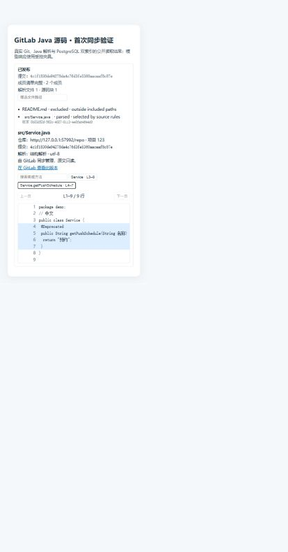

# T02 验证与审查记录

日期：2026-09-28。Ticket：[GitHub #10](https://github.com/rudyvv/myWeknora/issues/10)。分支：`codex/gitlab-code-wiki-rag`。用户确认的审查起点：`57ab2787`；实现：`055be43e`；审查修复：`2e3d379a`。

## 已交付范围

显式选择的 1–100 个 Java 文件、总计不超过 16 MiB、UTF-8/BOM、内置 PostgreSQL/ParadeDB 双索引，构成首次同步完整路径：GitLab 固定 SHA → 只读 Git 对象 → 真实 Java 解析 → 完整清单与不可变版本 → staging → 双索引准备 → 单事务发布 → 方法检索与原文阅读。

成熟解析依赖与 grammar 固定版本和校验值，构建时下载、运行时离线；不 checkout 或执行目标仓库。原始字节、CRLF、中文及一基行号保留；签名上下文单独标明范围，索引头不冒充连续原文。源文件身份稳定，块带版本、SHA、路径、符号与同 SHA 外链。普通写入口拒绝修改源文件与块，标签、说明和自定义元数据仍管理；不自动每文件生成 Wiki。

运行详情显示全部成员、排除原因、阶段和数量；已发布成员打开固定版本阅读器。指定版本不匹配当前发布时失败，不静默替换。跨请求快照一致性、历史证据、增量、其他语言、全仓规模和 Wiki 由后续 tickets 验收。部署及复现命令见 [sourceparser/README.md](../../sourceparser/README.md)。

## Standards

独立子代理按 AGENTS、CONTEXT、README、相关 ADR 和代码气味基线审查。

初审 2 个 P1：问题重新生成可覆盖源码证据；首次摘要生成绕过刷新保护，可创建清单外摘要块。已在加载持久化 Knowledge 后、任何模型调用或修改前拒绝源码。公开服务测试先确认遗漏，再验证修复，不以内部方法或调用次数作为断言。

复审剩余 **0 项**，无新增需单列的代码气味。

## Spec

初审 2 项：P1 整文件/文件列表块删除没有源码保护；P2 公开 HybridSearch 的标签过滤只查索引标签，不能命中已打标签的源文件。

删除现在先验证全部持久化父 Knowledge，任何源码使整个操作在删除前拒绝。标签从稳定源文件关系读取，核验标签所属 tenant/KB，两路都在排序和 LIMIT 前过滤，保留原索引标签行为。真实公开测试覆盖两路匹配、不匹配和移除标签立即失效，无需重建快照。

复审剩余 **0 项**。结论限于 T02。

## 验证结果

- 真实集成：`go test -tags integration ./internal/application/service -run '^TestSource' -count=1`，8 项通过（修复后 33.489 秒）；追加标签移除后单项通过（8.731 秒）。真实 Git、锁定解析器、独立 PostgreSQL/ParadeDB schema 与实际双索引；外部 GitLab HTTP、Embedding 响应及队列受控。
- 公开行为：两路方法检索、原文证据/下载、版本及 tenant/KB/文件/tag 范围、staging 不可见、索引/向量/编码失败不发布、普通写入口拒绝源码与说明可修改均已验证。
- Go 选定回归通过：chunk/knowledge 写权限、生成、复制、转移、移动及 HTTP；此前 GitLab/source/repository/Agent 选定检查也通过。更宽的 Source 匹配选中三个原有 SQLite 清理测试，因 Windows 文件锁在 TempDir 清理时失败。
- 服务端：`internal/container` 选定检查与 `go build ./cmd/server` 通过。机器缺系统 `sqlite3.h`，验证使用已安装 `go-sqlite3` 的 binding 头文件及临时 `CGO_CFLAGS`，不修改依赖或产品配置。首次模块缓存写受沙箱限制，放宽权限后构建成功。
- 解析器：Windows 真实 HTTP 合约 4 项通过；最终 Docker 镜像带许可证构建成功，断网、只读、非 root、CPU/内存/PID 限制下同样 4 项通过（2.979 秒）。覆盖 CRLF/中文/BOM、类/方法/注解、长签名、超大 Unicode 结构连续字节和分离上下文、路径/hash/语言约束。Compose 配置验证通过。
- 前端：两个新组件真实 Vue 模板 DOM 测试与 `vue-tsc --build` 通过，覆盖只读、定位、SHA 链接、版本不匹配及仅打开已发布成员。
- UI：真实集成的公开 GetSyncLog/GetSourceFile 结果挂载真实组件，模型响应为受控夹具。发布清单、固定版本、方法 L4–7 高亮和同 SHA 外链已查看。下图是组件演示，不是完整部署或代表仓库验收。
- 全量前端运行一次：911 项，906 通过、5 失败。三个未修改的 SandboxConfigEditorDrawer 静态/规则检查失败；SandboxTerminal、CLI 集成依赖 POSIX/WSL shell。未在基点独立重跑，不能把全部失败断言为已证明的基线失败。
- 全量 Go 运行一次，未全通过：系统 SQLite 头文件缺失、Windows SQLite 文件锁/符号链接权限、POSIX shell/路径前提，以及未修改的飞书 Wiki 日志汇总、部署能力文本检查。未在基点独立重跑，也未反复全量运行掩盖限制。`golangci-lint` 未安装，未执行。
- gofmt 与 `git diff --check` 通过。真实模型质量、内网 GitLab 部署、约 125 万行代表仓库性能尚未验收。

